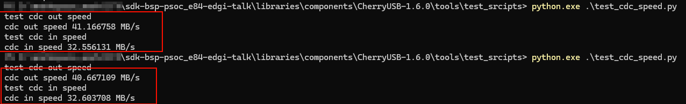
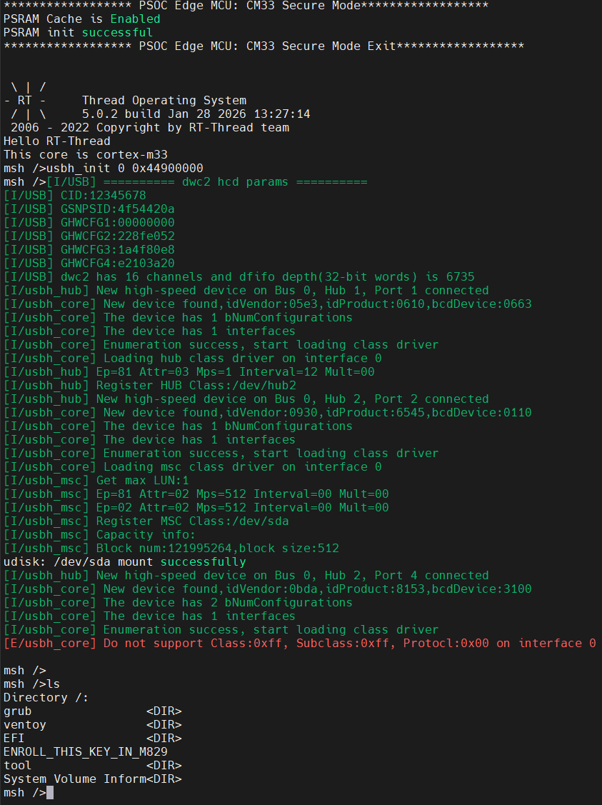
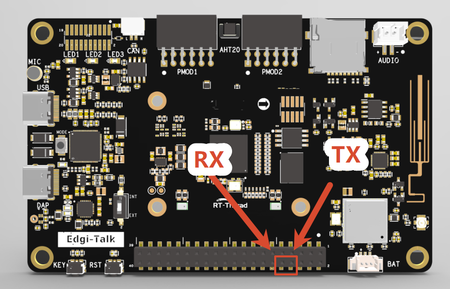

# Edgi_Talk_M33_USB_RoleSwitch CherryUSB Example Project

[**中文**](./README_zh.md) | **English**

## Overview

This project integrates **CherryUSB** on the **M33 core** of the Edgi-Talk board. It is prepared for **USB device mode** and uses the Infineon **DWC2** IP.

## Default Configuration

* `RT_USING_CHERRYUSB = y`
* `RT_CHERRYUSB_DEVICE = y`
* `RT_CHERRYUSB_DEVICE_SPEED_HS = y`
* `RT_CHERRYUSB_DEVICE_DWC2_INFINEON = y`
* Device template: **CDC** (user application)

## Build and Flash

1. Build the project in RT-Thread Studio or with SCons.
2. Flash the firmware via KitProg3 (DAP).
3. Connect the Type-C USB port for device enumeration.
4. Use CherryUSB test scripts to benchmark the CDC device.

## Configuration (Switching Modes)

Use the board Kconfig entry to switch roles. The graphical board configurator
does not need to be regenerated for USB host/device selection.

```
RT-Thread Settings ->
Hardware Drivers Config ->
Onboard Peripheral Drivers ->
Enable USB ->
USB role
```

* **Device CDC ACM**: selects `RT_CHERRYUSB_DEVICE`, high speed, Infineon DWC2, CDC ACM, and the CDC ACM template.
* **Host MSC**: selects `RT_CHERRYUSB_HOST`, Infineon DWC2, MSC, DFS, and ElmFat.

If an IP/class requires extra parameters, edit:

* `libraries/Common/board/ports/usb/usb_config.h`

## USB CDC Device Result



## USB U-Disk (Host) Result



## Startup Sequence

The M55 core depends on the M33 boot flow. Flash in this order:

```
+------------------+
|   Secure M33     |
|  (Secure Core)   |
+------------------+
		  |
		  v
+------------------+
|       M33        |
| (Non-Secure Core)|
+------------------+
		  |
		  v
+-------------------+
|       M55         |
| (Application Core)|
+-------------------+
```

## Notes

> **⚠️ Note:** This project requires **RT-Thread Studio 2.2.9** or higher.

* The M33 project serial log is not output through the onboard DAP virtual COM port directly. To view `msh />` and demo logs, connect an external USB-to-UART adapter, such as CH340.
The connection position is shown below. Connect the board RX to the UART adapter TX, connect the board TX to the UART adapter RX, and set the host serial baud rate to 115200:



* This project targets the M33 core and supports USB device CDC ACM and USB host MSC roles.
* For the M55 USB role-switching example, see [projects/Edgi_Talk_CherryUSB/Edgi_Talk_M55_USB_RoleSwitch/README.md](../Edgi_Talk_M55_USB_RoleSwitch/README.md).
* To run an M55 project, it is recommended to flash **Edgi_Talk_M33_Template** first. It is a clean M33 project and is suitable as the base firmware before starting M55.
