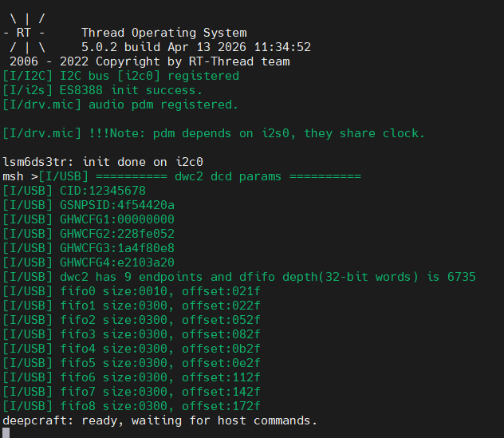
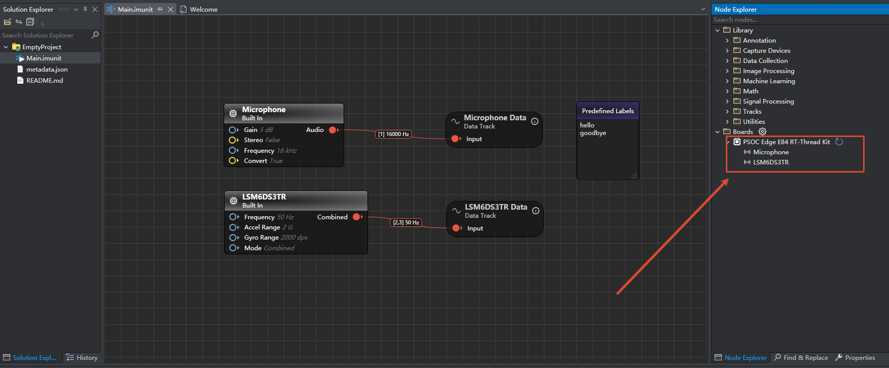
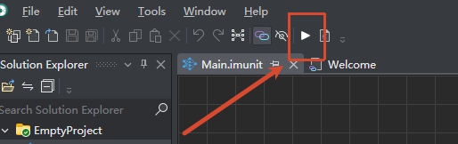
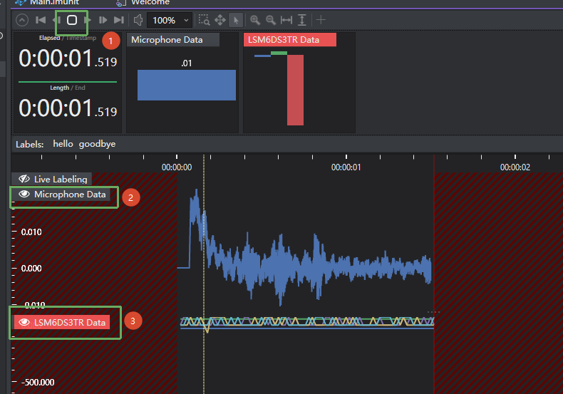

# Edgi_Talk_USB_Deepcraft Example Project

[**中文**](./README_zh.md) | **English**

## Overview

This project runs on the **Edgi-Talk M55 core** and bridges onboard sensors to host tools over **CherryUSB Device CDC ACM** using a **Protocol Buffers (nanopb)** based streaming protocol.

At startup, firmware:

1. Creates a protocol context (`protocol_create`) with a board UUID.
2. Registers device drivers (currently microphone and LSM6DS3 IMU).
3. Initializes USB CDC device transport.
4. Enters a request-processing loop via `protocol_process_request`.

## Default Configuration

Key macros in `rtconfig.h`:

* `RT_USING_CHERRYUSB = y`
* `RT_CHERRYUSB_DEVICE = y`
* `RT_CHERRYUSB_DEVICE_DWC2_INFINEON = y`
* `RT_CHERRYUSB_DEVICE_CDC_ACM = y`
* `RT_CHERRYUSB_DEVICE_TEMPLATE_CDC_ACM = y`

USB identity from `applications/deepcraft/deepcraft_usbd.c`:

* VID: `0x058B`
* PID: `0x027D`
* Product string: `Imagimob Streaming Device`

## Integrated Device Capabilities

`system_load_device_drivers()` currently registers:

* **Microphone (PDM/PCM)**
  * Options: gain, mono/stereo, sample frequency
  * Stream type: `S16` output stream
* **LSM6DS3 IMU**
  * Options: sample rate, accel range, gyro range, stream mode
  * Modes: Combined / Split / Only Accel / Only Gyro

## Build and Flash

1. Build in RT-Thread Studio or with SCons.
2. Flash firmware via KitProg3 (DAP).
3. Connect the board to host through Type-C and wait for CDC enumeration.

On successful startup, UART prints:

* `deepcraft: ready, waiting for host commands.`



## Deepcraft Studio Usage

1. Download and install Deepcraft Studio:
  [Install & Download Studio](https://developer.imagimob.com/deepcraft-studio/install-download-studio)
2. Create a blank project:
  [Real-Time Data Streaming with PSOC Edge E84 HMI](https://developer.imagimob.com/deepcraft-studio/data-preparation/data-collection/collect-data-infineon-boards/collect-data-hmi-kit)
3. Connect the board to your PC with a USB data cable, then verify the device appears in Deepcraft Studio.



4. Click the build/run option to enter the data collection window.



5. Start recording and verify microphone plus 3-axis IMU data are streamed in real time.



For more tutorials, see:
[Data Collection Microphone](https://developer.imagimob.com/deepcraft-studio/data-preparation/data-collection/collect-data-infineon-boards/collect-data-edge-evaluation-kit/data-collection-microphone)

## Host Communication Notes

* Transport: USB CDC ACM
* Encoding: nanopb / protobuf
* Error recovery:
  * If request decode fails (`PROTOCOL_STATUS_FAILED_TO_DECODE_REQUEST`), firmware calls `deepcraft_usbd_resync_rx()` to clear and resync the RX ring buffer.

## Startup Sequence

The M55 core depends on the M33 boot flow. Recommended flashing order:

```
+------------------+
|   Secure M33     |
|  (Secure Core)   |
+------------------+
          |
          v
+------------------+
|       M33        |
| (Non-Secure Core)|
+------------------+
          |
          v
+-------------------+
|       M55         |
| (Application Core)|
+-------------------+
```

## Notes

> **Note:** RT-Thread Studio **2.2.9** or newer is recommended.

* If this M55 project does not run, flash `Edgi_Talk_M33_Template` first.
* Enable CM55 in the M33 project:

  ```
  RT-Thread Settings -> Hardware -> select SOC Multi Core Mode -> Enable CM55 Core
  ```

