# Edgi-Talk_M33_Driver_All Multi-Demo Project

[**Chinese**](./README_zh.md) | **English**

## Introduction

This project is based on the **Edgi-Talk platform** and runs on **RT-Thread on the Cortex-M33 core**. It integrates multiple common peripheral demos into one firmware, making it convenient to validate sensors, ADC, HyperRAM, key interrupts, RTC, SD card filesystem, external Flash filesystem, and WAV audio playback in a single image.

The project provides the following MSH commands:

| Command | Description |
| ---- | ---- |
| `demo_aht20` | Read AHT10/AHT20 temperature and humidity |
| `demo_lsm6ds3 [count] [delay_ms]` | Read LSM6DS3 6-axis sensor data |
| `demo_audio start/stop/status [speaker_volume] [mic_gain]` | Real-time audio microphone-to-speaker loopback |
| `wavplay -s <file>` | Play a WAV audio file |
| `demo_adc` | Read ADC1 Channel 1 voltage |
| `demo_hyperram` | Run a basic HyperRAM read/write check |
| `demo_hyperram_speed [size_kb] [loops]` | Run a HyperRAM bandwidth test |
| `demo_key` | Register the P8.3 key interrupt and toggle the blue LED when pressed |
| `demo_rtc [YYYY MM DD HH MM SS]` | Read or set RTC time |
| `demo_sdcard` | Run an SD card file write/read test |
| `demo_sdcard_speed [total_kb] [block_kb]` | Run an SD card sequential read/write speed test |
| `demo_flash_speed [total_kb] [block_kb]` | Run a `/flash` filesystem sequential read/write speed test |
| `core_mark` | Run the CoreMark CPU benchmark |

## Software Description

* The project is developed for the **Edgi-Talk** platform.
* **RT-Thread** is used as the operating system kernel.
* Each demo is triggered manually through an MSH command to avoid running multiple peripheral tests automatically after boot.
* The Audio demo uses the RT-Thread Audio framework, PDM microphone, and ES8388 codec. It occupies `mic0` and `sound0` after startup.
* The WavPlayer demo uses the RT-Thread `wavplayer` package to play WAV files. It occupies `sound0` during playback and cannot run together with the `demo_audio` loopback.
* CoreMark uses the RT-Thread `CoreMark` package. The default iteration count is `36000`, and it is started manually through an MSH command.
* SD card mounting is handled by the common filesystem initialization logic. The card is mounted automatically after insertion and unmounted after removal.
* External Flash is registered as `norflash0` through FAL. The `filesystem` partition is mounted to `/flash` as littlefs.
* Normal SDIO `CMD5 arg=0` timeout probing logs are silenced to avoid repeated console output during normal SD card detection.

## Notes

> **Note:** This project requires **RT-Thread Studio 2.2.9** or higher.

* The M33 project serial log is not output through the onboard DAP virtual COM port directly. To view `msh />` and demo logs, connect an external USB-to-UART adapter, such as CH340.
The connection position is shown below. Connect the board RX to the UART adapter TX, connect the board TX to the UART adapter RX, and set the host serial baud rate to 115200:


* After editing, save the configuration and regenerate the code.
* Format the SD card as FAT16/FAT32.
* If the SD card speed result is low, check the card speed grade, filesystem fragmentation, SDIO clock, bus width, and read/write block size first.
* `/flash` uses the external Flash `filesystem` partition. If the first mount fails, it is automatically formatted. If you need to preserve data on this partition, do not run a full-chip erase casually.
* If this example project does not run correctly, compile and flash **Edgi_Talk_M33_Template** first to ensure the initialization and core startup flow are normal before running this project.
* To run an M55 project, it is recommended to flash **Edgi_Talk_M33_Template** first. It is a clean M33 project and is suitable as the base firmware before starting M55.

## AHT20 Temperature and Humidity Demo

### Function

`demo_aht20` uses the AHT10/AHT20 package to read temperature and humidity once through `i2c1`, then prints the result through the serial console. The device handle is cached, so repeated command execution does not repeatedly initialize the sensor.

### Usage

```sh
demo_aht20
```

Example output:

```text
AHT10: temp 26.3 C, humidity 48.7 %
```

## LSM6DS3 6-Axis Sensor Demo

### Function

This demo is ported from the `Edgi_Talk_M33_LSM6DS3` example. It demonstrates how to use the **LSM6DS3TR-C 6-axis inertial measurement unit (IMU)**. The LSM6DS3TR-C integrates a 3-axis accelerometer, 3-axis gyroscope, and temperature sensor. It supports I2C/SPI interfaces and is commonly used for posture detection, motion recognition, gesture recognition, and wearable devices.

The command performs the following operations:

* Detects the LSM6DS3 device ID through `i2c0`.
* Resets the sensor and configures output data rate, accelerometer range, and gyroscope range.
* Polls 3-axis acceleration, 3-axis angular rate, and temperature.
* Prints data through the serial console. It does not print continuously after power-on.

### Hardware

#### LSM6DS3TR-C Interface

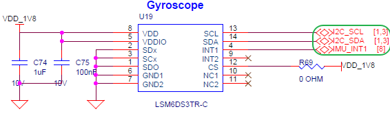

#### BTB Connector

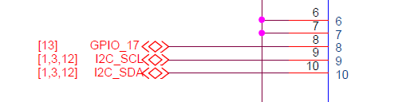

#### MCU Pins

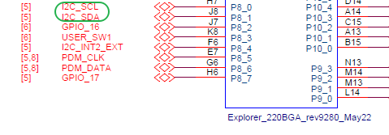

### Usage

```sh
demo_lsm6ds3
demo_lsm6ds3 10 200
```

Parameters:

* `count`: Number of samples. Default is `5`; set to `0` for continuous sampling.
* `delay_ms`: Sampling interval. Default is `500 ms`.

Example output:

```text
LSM6DS3: found on i2c0 addr 0x6A
LSM6DS3 sample: count=5, delay=500 ms
Acceleration [mg]: 15.23  -3.12  1000.45
Angular rate [mdps]: 2.50  -1.25  0.75
Temperature [degC]: 26.54
```

## Audio Loopback Demo

### Function

This demo is ported from the `Edgi_Talk_M33_Audio` example. It demonstrates real-time audio loopback using **PDM microphone capture + ES8388 codec playback**. The audio device consists of the audio bus interface, control bus interface, codec, speaker, and microphone. The RT-Thread Audio framework handles device registration, open/close, read/write, volume control, and stream control.

The command performs the following operations:

* Opens the `mic0` recording device and the `sound0` playback device.
* Explicitly configures audio as 16 kHz, mono, 16-bit, matching the PDM microphone output.
* Sets speaker volume and microphone gain.
* Creates a background thread that continuously reads microphone data and writes it to the speaker.
* Starts and stops manually through MSH commands. It does not enter loopback automatically after power-on.

> **Note:** The original Audio project used the P8.3 key to toggle playback state. In this multi-demo project, P8.3 is used by `demo_key`, so the Audio demo is controlled by MSH commands to avoid two demos registering the same key interrupt.

### Hardware

#### Embedded Audio System

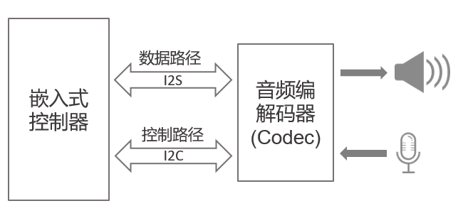

#### ES8388 Interface


#### Speaker Interface

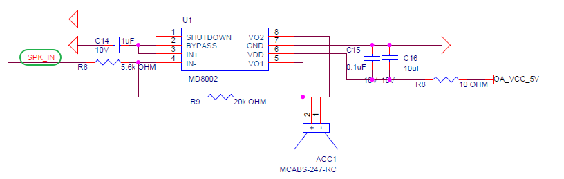

#### Control Pins

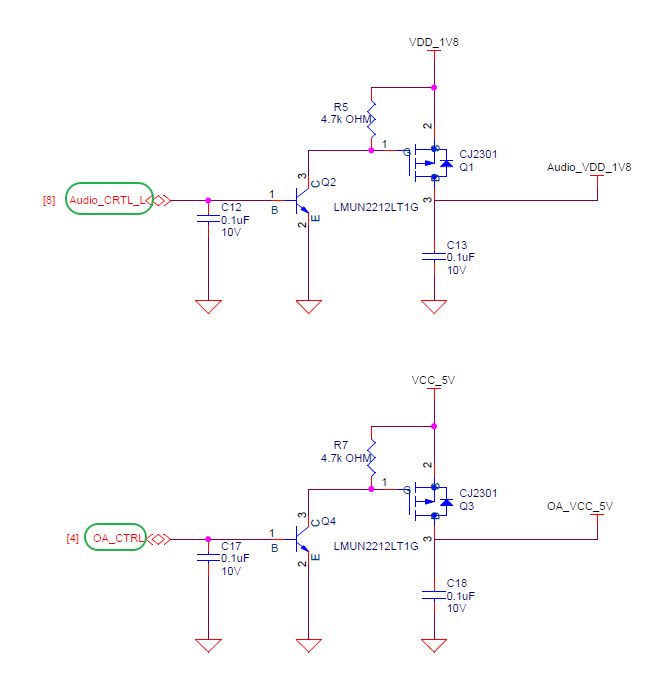

#### BTB Connector


#### MCU Pins


#### Board Location


### Usage

```sh
demo_audio start
demo_audio start 60 30
demo_audio status
demo_audio stop
```

Parameters:

* `speaker_volume`: Speaker volume. Default is `60`.
* `mic_gain`: Microphone gain. Default is `30`.

Example output:

```text
Audio loopback started: speaker=60, mic_gain=30
Audio loopback: running, speaker=60, mic_gain=30
Stopping audio loopback...
Audio loopback stopped
```

## WavPlayer Audio Playback Demo

### Function

This demo is ported from the `Edgi_Talk_M33_WavPlayer` example. It demonstrates WAV file playback using the **RT-Thread wavplayer package + Audio device driver + filesystem**. `wavplayer` reads the WAV header, configures `sound0` according to the sample rate, channel count, and 16-bit width in the file, then outputs audio through the ES8388 codec and speaker.

The current project enables:

* The `wavplay` playback command.
* The `optparse` command-line parsing package.
* The `sound0` playback device.

The `wavrecord` recording command is not enabled in this project. Use `demo_audio` for recording/loopback validation to avoid resource-management conflicts in the multi-demo project.

> **Note:** `wavplay` and `demo_audio` both occupy `sound0`. Before playing a WAV file, run `demo_audio stop` and confirm that the loopback demo has stopped.

### Hardware

#### Audio System


#### ES8388 Interface

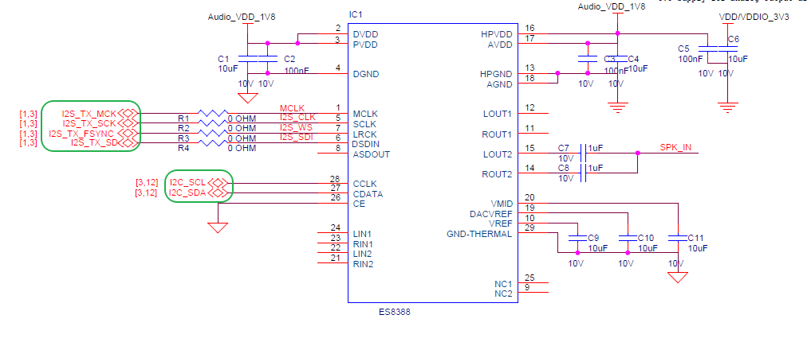

#### Speaker Interface


#### Control Pins


#### BTB Connector

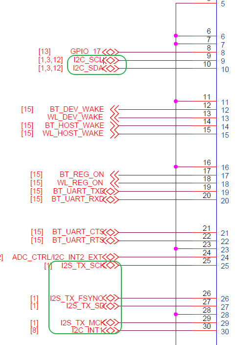

#### MCU Pins

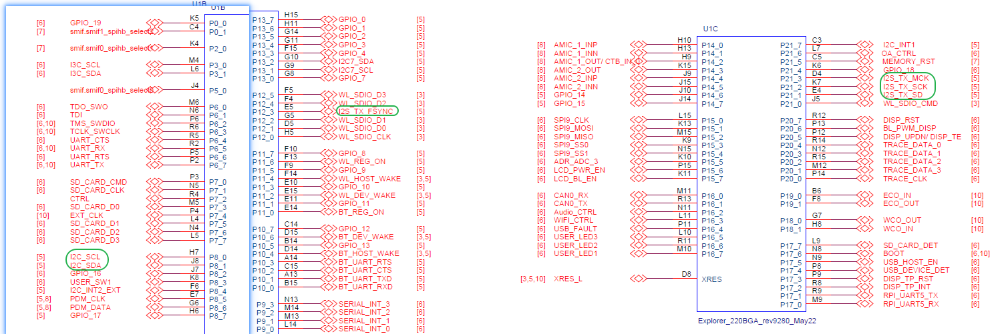

#### Board Location

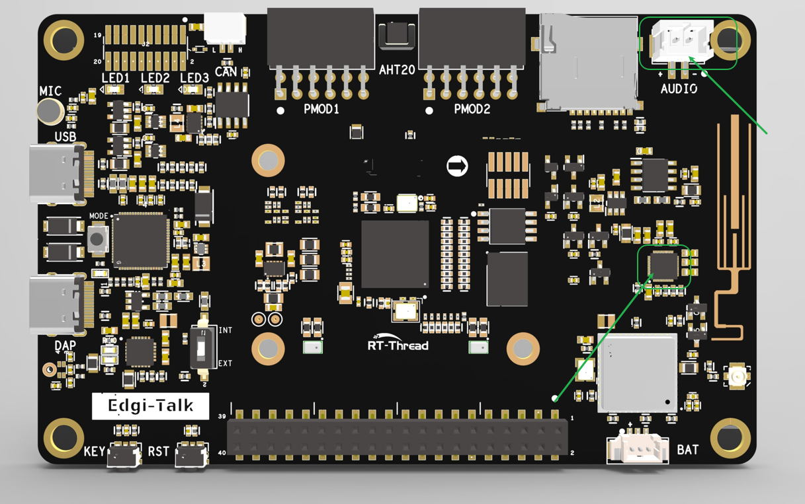

### Usage

Place the WAV file in a mounted filesystem. For example, after the SD card is mounted to `/sdcard`:

```sh
cd /sdcard
wavplay -s 16000.wav
```

You can also use the full path:

```sh
wavplay -s /sdcard/16000.wav
```

Common commands:

```sh
wavplay -h
wavplay -s /sdcard/16000.wav
wavplay -t
wavplay -p
wavplay -r
wavplay -v 80
```

Parameters:

* `-s <file>`: Start playing the specified WAV file.
* `-t`: Stop playback.
* `-p`: Pause playback.
* `-r`: Resume playback.
* `-v <0-100>`: Set playback volume.

Example output:

```text
msh /sdcard>wavplay -s 16000.wav
[I/WAV_PLAYER] play start, uri=16000.wav
```

## CoreMark Benchmark Demo

### Function

This demo enables the RT-Thread `CoreMark` package for CPU performance benchmarking. The current configuration refers to the `Edgi_Talk_M55_CoreMark` project. The default iteration count is `36000`, and the floating-point version is not enabled.

### Usage

```sh
core_mark
```

The command prints CoreMark parameters, elapsed time, verification result, and final score. Stop other high-load demos during testing to avoid SD card, audio, or sensor polling affecting the result.

## ADC Demo

### Function

This demo is ported from the `Edgi_Talk_M33_ADC` example. It demonstrates how to use the **ADC (Analog-to-Digital Converter)**. The ADC converts continuous analog voltage into a digital value for MCU processing.

> **Note:** In the current hardware connection, the ADC is only used to sample battery voltage. The Raspberry Pi connector and other external interfaces are not connected to this ADC channel, so they cannot be sampled by this command.

The command performs the following operations:

* Enables ADC1 Channel 1.
* Pulls the P8.4 ADC power-control pin high on first execution.
* Reads one ADC raw value and converts it to voltage.

### Hardware

#### Interface

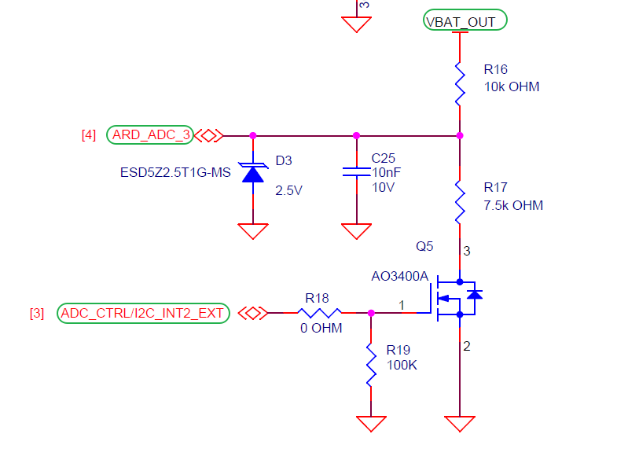

#### BTB Connector

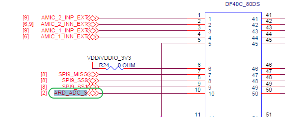

#### MCU Pins

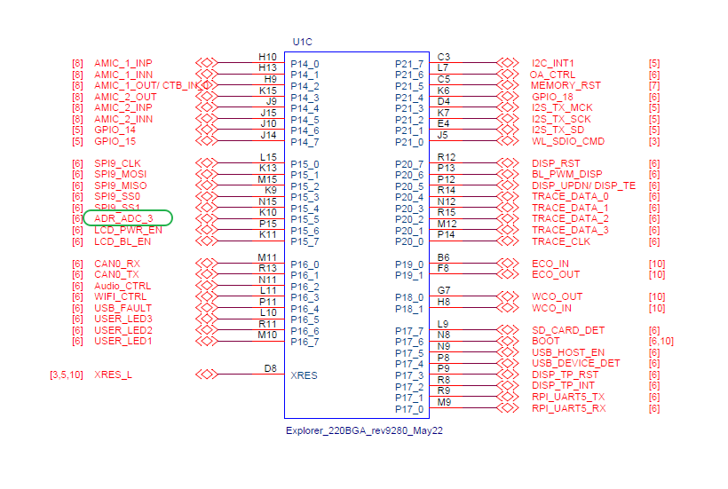

#### Board Location

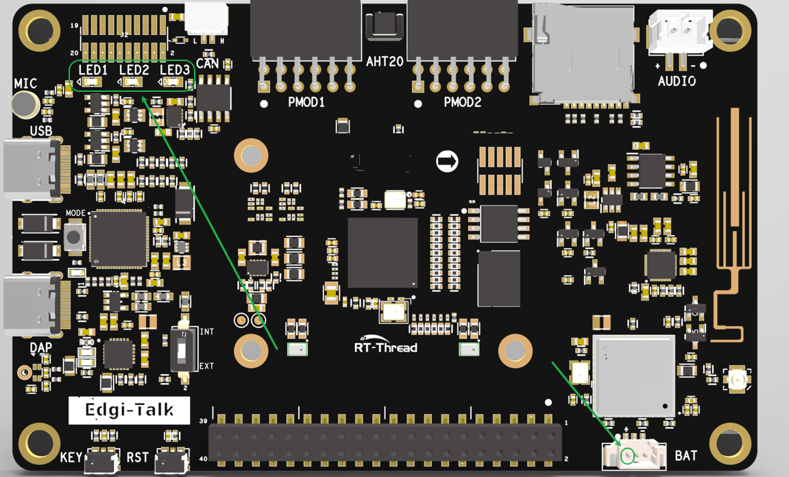

### Usage

```sh
demo_adc
```

Example output:

```text
CH1: 3.123 V (raw=1340)
```

## HyperRAM Demo

### Function

This demo is ported from the `Edgi_Talk_M33_HyperRam` example. It validates **HyperRAM** mapping, basic read/write access, and bandwidth performance. After the HyperRAM driver is initialized, the memory region is mapped into the system address space and can be used by applications for large buffers or external heap.

### Basic Read/Write Check

```sh
demo_hyperram
```

This command allocates a HyperRAM buffer, writes test data, reads it back, and verifies the result.

### Bandwidth Test

```sh
demo_hyperram_speed
demo_hyperram_speed 1024 8
```

Parameters:

* `size_kb`: Data size for each test. The default value is set inside the demo.
* `loops`: Loop count. Larger values produce more stable statistics.

The test includes sequential write, sequential read, and memory-copy throughput.

## Key Interrupt Demo

### Function

This demo is ported from the `Edgi_Talk_M33_Key_Irq` example. It demonstrates GPIO interrupt usage through the RT-Thread PIN driver.

The command performs the following operations:

* Configures P8.3 as pull-up input.
* Registers a falling-edge interrupt callback.
* Toggles the P16.5 blue LED and prints the state after each key press.

### Hardware

#### Button Interface

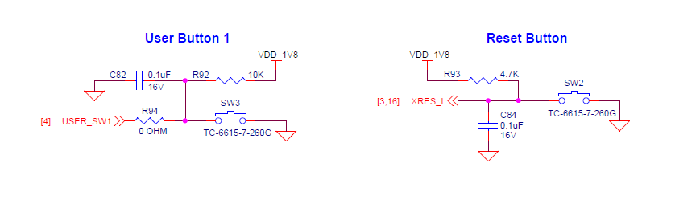

#### BTB Connector

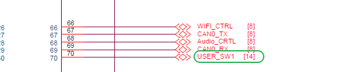

#### MCU Interface

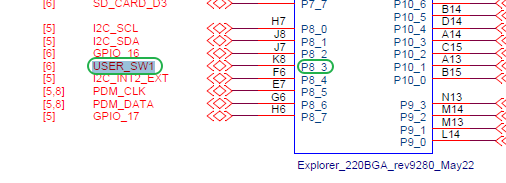

#### Board Location

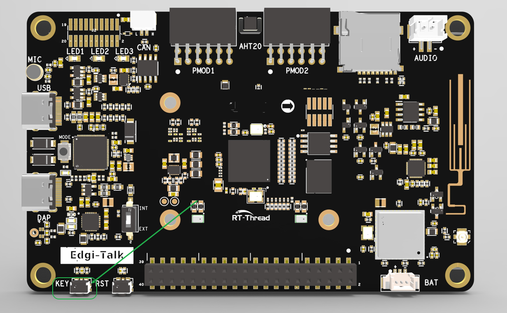

### Usage

```sh
demo_key
```

Example output:

```text
Key IRQ ready. Press the button on P8.3.
button pressed (led ON)
button pressed (led OFF)
```

## RTC Demo

### Function

This demo is ported from the `Edgi_Talk_M33_RTC` example. It demonstrates how to read and set the **RTC (Real-Time Clock)**. RTC can be used for system time, log timestamps, scheduled tasks, and low-power wakeup scenarios.

### Usage

Read the current time:

```sh
demo_rtc
```

Set the time and read it back:

```sh
demo_rtc 2026 7 17 10 30 0
```

Example output:

```text
Fri Jul 17 10:30:00 2026
```

## SD Card Demo

### Function

This demo is ported from the `Edgi_Talk_M33_SDCARD` example. It demonstrates SD card mounting, file writing, file reading, and read/write speed testing. SD cards are non-volatile storage devices commonly used for logs, configuration files, and audio/video buffering.

The current project includes hot-plug handling:

* If an SD card is inserted during power-on, it is automatically mounted to `/sdcard`.
* If the SD card is removed during runtime, it is automatically unmounted.
* When no card is inserted, the system rescans at a low frequency to avoid repeated console output and thread stack overflow.

### File Write/Read Test

```sh
demo_sdcard
```

This command writes text to `/sdcard/demo_test.txt`, reads it back, and prints it.

### Sequential Read/Write Speed Test

```sh
demo_sdcard_speed
demo_sdcard_speed 8192 64
```

Parameters:

* `total_kb`: Total test file size. Default is `4096 KB`.
* `block_kb`: Block size for each read/write operation. Default is `64 KB`; maximum is `64 KB`.

## Flash Filesystem Demo

### Function

This project enables **FAL + MTD NOR + littlefs**. During startup, the external Flash `filesystem` partition is mounted automatically to `/flash`. If the first mount fails, the initialization logic tries to format the partition and mount it again.

Flash partition configuration:

| Partition | FAL Offset | Size | Purpose |
| ---- | ---- | ---- | ---- |
| `whd_firmware` | `0x00000` | `384 KB` | Wi-Fi firmware |
| `whd_clm` | `0x60000` | `64 KB` | Wi-Fi CLM data |
| `whd_nvram` | `0x70000` | `64 KB` | Wi-Fi NVRAM |
| `bt_image` | `0x80000` | `512 KB` | Bluetooth image |
| `filesystem` | `0x100000` | `1024 KB` | `/flash` littlefs filesystem |

> **Note:** `demo_flash_speed` creates a temporary test file under `/flash` and deletes it after the test. This command triggers Flash erase/write operations. Avoid repeatedly running large tests on a `/flash` partition that contains important data.

### Sequential Read/Write Speed Test

```sh
demo_flash_speed
demo_flash_speed 512 4
```

Parameters:

* `total_kb`: Total test file size. Default is `512 KB`.
* `block_kb`: Block size for each read/write operation. Default is `4 KB`; valid range is `1 KB` to `64 KB`.

Example output:

```text
Flash speed test
file=/flash/flash_speed.bin, total=512 KB, block=4 KB
write  524288 bytes, 1234 ms, 0.41 MB/s (414 KB/s)
read   524288 bytes, 78 ms, 6.41 MB/s (6564 KB/s)
```

## Build and Flash

1. Open the project and complete the build.
2. Connect the board USB port to the PC using the **onboard debugger (DAP)**.
3. Flash the generated firmware to the board through the programming tool, or run the following command from the project root:

   ```powershell
   .\m33_program.ps1
   ```

   To erase the whole chip before flashing, run:

   ```powershell
   .\m33_program.ps1 -EraseAll $true
   ```

4. Open the serial terminal, enter `msh />`, and run the required demo command.

## Boot Sequence

The system boot sequence is as follows:

```text
+------------------+
|   Secure M33     |
|   (Secure Core)  |
+------------------+
          |
          v
+------------------+
|       M33        |
| (Non-Secure Core)|
+------------------+
          |
          v
+-------------------+
|       M55         |
| (Application Core)|
+-------------------+
```

> **Note:** The secure core firmware is integrated into the M33 project build and packaging flow. Prepare and flash firmware strictly according to the boot sequence above; otherwise, the system may fail to run correctly.

To enable M55, configure the **M33 project** as follows:

```text
RT-Thread Settings --> Hardware --> select SOC Multi Core Mode --> Enable CM55 Core
```
