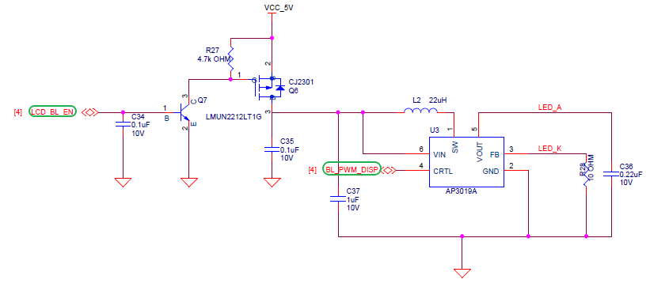
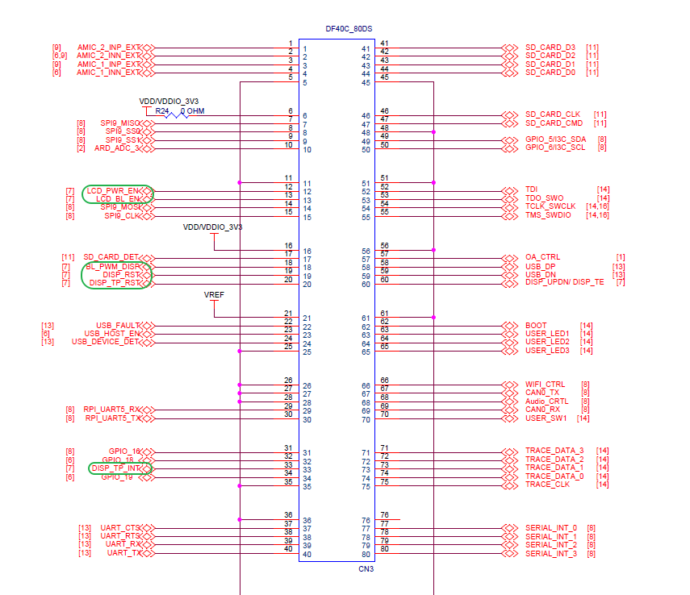

# Edgi-Talk_M55_LVGL Example Project

[**中文**](./README_zh.md) | **English**

## Introduction

This example is based on the **Edgi-Talk platform** and demonstrates **LVGL with multiple display demos** running on the **M55 application core** under the **RT-Thread real-time operating system**.
The current default demo is **Virtual3D Animated Emoji**, which can be used to verify the LCD display, touch input, LVGL rendering flow, and M55-side graphics acceleration related configuration. The project can also be switched to LVGL official Music, Benchmark, and Stress demos as a reference for GUI application development.

### LVGL Overview

**LVGL** (Light and Versatile Graphics Library) is an open-source embedded GUI development framework designed for resource-constrained devices. It provides modern graphical interfaces with optimized CPU and memory usage, running efficiently on both low-end MCUs and more powerful MPU platforms.

#### Key Features

1. **Lightweight**
   Optimized for minimal memory and CPU usage, ideal for low-power devices and resource-constrained environments.

2. **Cross-platform**
   Runs on multiple operating systems (FreeRTOS, RT-Thread, Zephyr, Linux) or bare-metal platforms. Only requires display and input drivers to be ported.

3. **Rich Widgets**
   Includes buttons, labels, sliders, charts, tables, lists, etc., and allows custom widget extensions.

4. **Advanced Rendering**
   Supports anti-aliasing, transparency, gradients, shadows, rounded corners, and animations for modern UIs.

5. **Input Device Support**
   Supports touchscreens, capacitive touch, mouse, keyboard, encoder, and multi-touch. Events are unified via LVGL’s event system.

6. **Internationalization**
   UTF-8 encoding with support for bidirectional text (e.g., Arabic, Hebrew).

7. **Extensibility**
   Flexible themes, styles, and integration with file systems and image decoders.

#### Applications

LVGL is widely used in:

* Consumer electronics (smart home panels, smartwatches, appliances)
* Industrial HMI and instrumentation
* Automotive displays (central console, passenger screen, instrument cluster)
* Medical devices (portable monitors, handheld instruments)

#### Ecosystem & Community

LVGL is **MIT licensed** and supported by **SquareLine Studio** for GUI design and **LVGL Simulator** for PC-based development. A large community provides open-source widgets, themes, and porting examples.

## Hardware Description

### Backlight Interface



### MIPI Interface


### PWR Interface


### BTB Socket




### MCU Interface


## Software Description

* Developed on the **Edgi-Talk platform**, running on the **M55 application core**.
* Example features:

  * Initialize **LVGL 9.2**, the LCD display driver, and the touch input driver
  * Start the **Virtual3D Animated Emoji** demo by default
  * Support switching to **lv_demo_music**, **lv_demo_benchmark**, **lv_demo_stress**, and other LVGL demos
  * Enable M55 I-Cache/D-Cache by default and use AXIDMAC to optimize RGB565 area copy
* Code structure is clear for understanding display driver integration and LVGL porting.

## Demo Description

This project selects the LVGL demo through the `BSP_LVGL_DEMO_*` configuration options. The default configuration is `BSP_LVGL_DEMO_VIRTUAL3D_EMOJI`.

| Configuration | Demo | Description |
| --- | --- | --- |
| `BSP_LVGL_DEMO_VIRTUAL3D_EMOJI` | Virtual3D Animated Emoji | Default demo. It displays a 3D Emoji animation and supports touch dragging, which helps verify the Virtual3D, LVGL display refresh, and touch input paths. This demo only supports LCD rotation at 0 or 180 degrees. |
| `BSP_LVGL_DEMO_MUSIC` | LVGL Music Demo | Official LVGL music UI demo, mainly used to verify complex widgets, layouts, styles, and animations. |
| `BSP_LVGL_DEMO_BENCHMARK` | LVGL Benchmark Demo | Official LVGL performance benchmark demo, used to observe rendering performance, frame rate, and score. |
| `BSP_LVGL_DEMO_STRESS` | LVGL Stress Demo | Official LVGL stress test demo. It repeatedly creates, refreshes, and destroys widgets to verify rendering stability and memory usage. |

To switch demos, modify the LVGL Demo configuration in **RT-Thread Settings** or `menuconfig`. It is recommended to select only one `BSP_LVGL_DEMO_*` option at a time, then regenerate the configuration, rebuild, and download the firmware.


## Usage

### Build and Download

1. Open and compile the project.
2. Connect the board USB to the PC using the **onboard debugger (DAP)**.
3. Flash the generated firmware to the board.

### Running Result

* After flashing and powering on, the example starts automatically.
* With the default configuration, the system starts **Virtual3D Animated Emoji**. The LCD displays the 3D Emoji animation, with the title `Virtual3D Animated Emoji` and the hint `Drag the 3D emoji`.
* The serial console prints the current demo and LCD rotation angle, for example:

```
LVGL virtual3d_emoji demo start, lcd rotation=0
```

* To check the Virtual3D demo status, run the following commands in the MSH console:

```
virtual3d_demo_stat
virtual3d_render_stat
```

* If the demo is switched to Music, Benchmark, or Stress, the LCD displays the corresponding official LVGL demo UI.

## Notes

> **⚠️ Note:** This project requires **RT-Thread Studio 2.2.9** or higher.

* To modify the **graphical configuration**, use:

```
tools/device-configurator/device-configurator.exe
libs/TARGET_APP_KIT_PSE84_EVAL_EPC2/config/design.modus
```

* Save and regenerate code after modifications.
* The default `BSP_LVGL_DEMO_VIRTUAL3D_EMOJI` demo does not support LCD rotation at 90 or 270 degrees. Use 0 or 180 degrees, or switch to another LVGL demo if landscape rotation is required.
* The default configuration enables `BSP_LVGL_ENABLE_CPU_CACHE` and `BSP_LCD_USE_AXIDMAC_AREA_COPY`. If cache, framebuffer, or LCD refresh settings are changed, also check display buffer coherency.
* If the screen shows no output, check:

  * LCD connections and power supply
  * `lv_port_disp.c` and `lv_port_indev.c` match the actual hardware
  * LCD rotation angle is compatible with the selected demo

## Startup Sequence

```
+------------------+
|   Secure M33     |
|  (Secure Core)   |
+------------------+
          |
          v
+------------------+
|       M33        |
| (Non-Secure Core)|
+------------------+
          |
          v
+-------------------+
|       M55         |
| (Application Core)|
+-------------------+
```

⚠️ Strictly follow the flashing order to ensure proper system operation.

---

* If the example fails, first flash **Edgi_Talk_M33_Template** to ensure proper initialization.
* To enable M55, configure in **M33 project**:

```
RT-Thread Settings --> Hardware --> select SOC Multi Core Mode --> Enable CM55 Core
```
