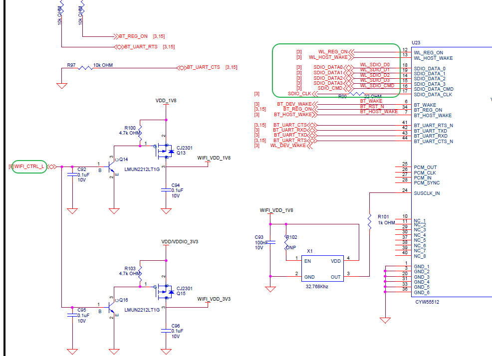
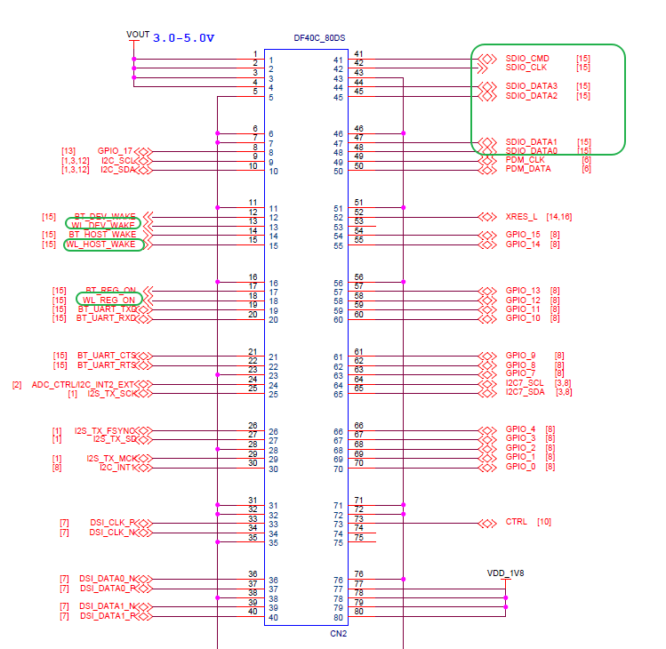
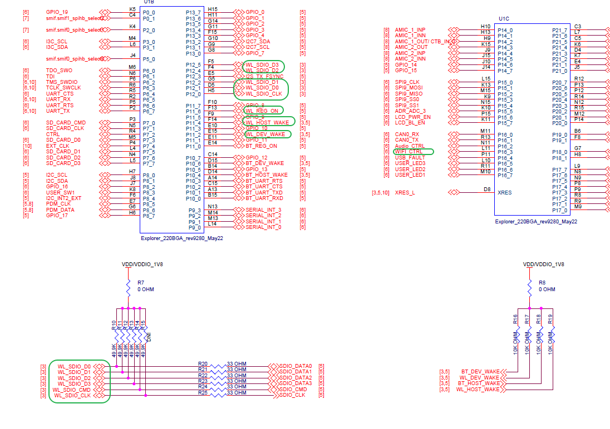
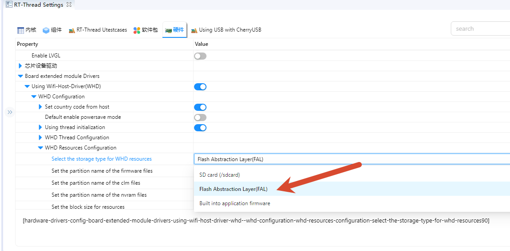
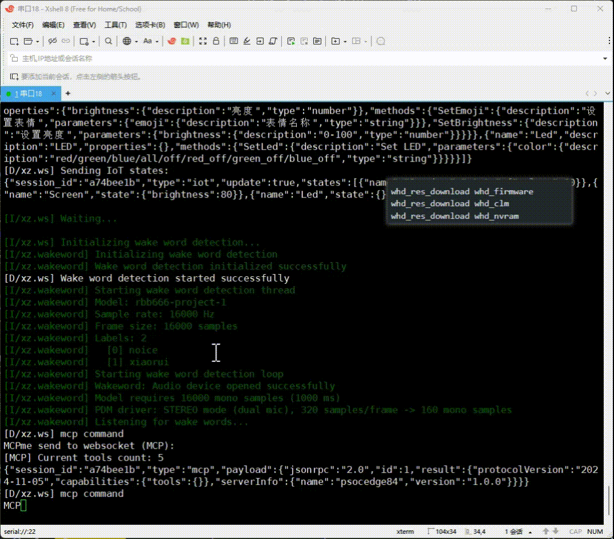
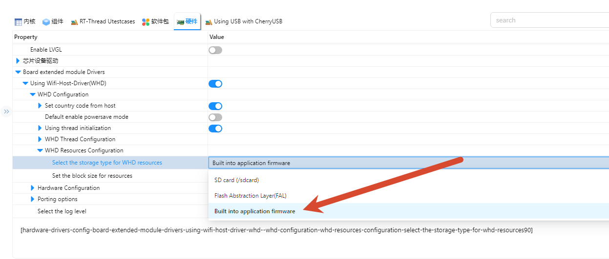
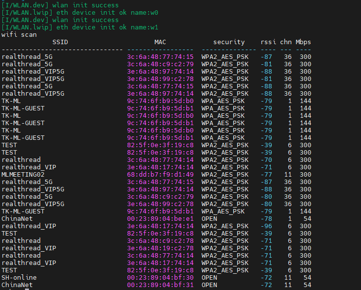
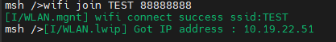
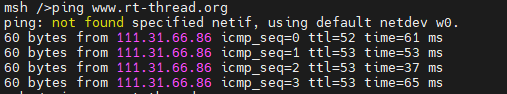

# Edgi_Talk_M55_WIFI Example Project

[**中文**](./README_zh.md) | **English**

## Introduction

This example demonstrates **Wi-Fi functionality** on the **M55 core** using **RT-Thread RTOS**.
It allows users to quickly test Wi-Fi scanning, connection, and performance, verifying the Wi-Fi module interface.

## Hardware Overview

### Wi-Fi Interface



### BTB Socket



### MCU Interface



## Software Description

* Developed on **Edgi-Talk** platform.

* Example features:

  * Wi-Fi scanning
  * Wi-Fi connection
  * Iperf performance test

* Provides a clear example of **Wi-Fi driver integration with RT-Thread**.

## Usage

### Build and Download

1. Open and compile the project.
2. Connect the board USB to PC via **DAP**.
3. Flash the compiled firmware from `Debug/rtthread.hex`.

### Prepare Wi-Fi Resources

WHD needs three resource files before the radio can start: firmware, CLM regulatory data, and board NVRAM. This document uses the FAL partition flow as the current method. The Wi-Fi resources are stored independently in the `whd_firmware`, `whd_clm`, and `whd_nvram` partitions. In this mode, flashing `Debug/rtthread.hex` only writes the application image; the Wi-Fi resources must be written separately from the serial terminal. The default Edgi-Talk resource files are provided in the project root `resources/` directory.

#### Current Method: FAL Partitions

Select this mode in `settings`:



The default Edgi-Talk resource files are provided in the project root `resources/` directory.

```
whd_res_download whd_firmware
whd_res_download whd_clm
whd_res_download whd_nvram
```

Each command switches to YMODEM mode. Use a terminal that supports YMODEM upload, such as Xshell, to send the matching file from `resources/`. Reset the board after all three transfers complete.

- Wait for the `Download ... success` message before starting the next transfer.
- After all three resources are written, reset the board so Wi-Fi can load the new resources. If the resource package is updated later, run `whd_res_download` again.



#### Extension: Build Wi-Fi Resources into the Application Image

If you want the Wi-Fi firmware to be programmed together with `Debug/rtthread.hex`, switch to `WHD_RESOURCES_IN_MEMORY`:



This mode builds the resource files from the project root `resources/` directory into the application image:

- `resources/55500A1.trxcse`
- `resources/55500A1.clm_blob`
- `resources/cyw55513modpse84som_rev3.txt`

After rebuilding, the Wi-Fi firmware, CLM, and NVRAM become part of the application image. After flashing `Debug/rtthread.hex`, you no longer need to run `whd_res_download whd_firmware`, `whd_res_download whd_clm`, or `whd_res_download whd_nvram`. If the Wi-Fi resource files are updated, rebuild and reflash the application image. This mode increases the application image size; the current CYW55500 firmware and CLM add about 240 KB of flash usage, plus the NVRAM text.

Note: RT-Thread Studio generates and runs makefiles from the `Debug` directory, while ENV/SCons builds from the project root. The current project handles this difference: Studio builds read resources from `../resources/`, and ENV/SCons generates resource code from the project root `resources/` directory. Place the resource files in the project root `resources/`; do not put them only in `Debug/resources/`.

#### Extension: SD Card Resource Loading

`WHD_RESOURCES_IN_SDCARD` loads the same three resources from `/sdcard` at runtime. The default filenames are `/sdcard/55500A1.trxcse`, `/sdcard/55500A1.clm_blob`, and `/sdcard/cyw55513modpse84som_rev3.txt`. This mode also enables the BSP SD card filesystem support used by the shared mount code.

### Running Result

* After power-on, the system initializes the Wi-Fi device.
* Connect to a Wi-Fi network via serial terminal:

```
wifi scan
```

```
wifi join <SSID> <PASSWORD>
```

```
ping www.rt-thread.org
```

* After connection, perform throughput test with iperf.
* A GUI tool (`jperf`) is provided under `packages/netutils-latest/tools`.

  * Extract `jperf.rar` and run the `.bat` file to launch the tool.
* Start iperf test from the board (replace `<PC_IP>` with actual PC IP):

```
iperf -c <PC_IP>
```

* Prefer 2.4 GHz network for testing (can use PC hotspot).

### Notes

* Ensure the Wi-Fi module is correctly connected.
* Serial terminal commands allow scanning, joining, and testing Wi-Fi.

## Startup Sequence

```
+------------------+
|   Secure M33     |
|  (Secure Core)   |
+------------------+
          |
          v
+------------------+
|       M33        |
| (Non-Secure Core)|
+------------------+
          |
          v
+-------------------+
|       M55         |
| (Application Core)|
+-------------------+
```

⚠️ Flash in this order strictly.

---

* If the example does not run, first compile and flash **Edgi_Talk_M33_Template**.
* The M55 core is started by the M33 boot chain. In current templates, **Edgi_Talk_M33_Template** already calls `Cy_SysEnableCM55(MXCM55, CY_CM55_APP_BOOT_ADDR, 10)` during board initialization, so the old `select SOC Multi Core Mode -> Enable CM55 Core` menu may no longer appear.


