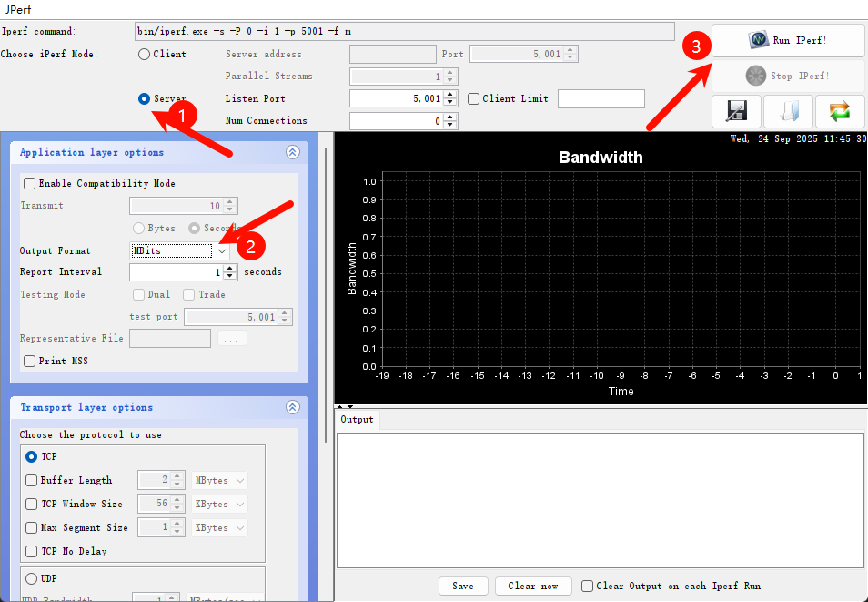

# Edgi_Talk_M55_WIFI 示例工程

**中文** | [**English**](./README.md)

## 简介

本示例工程基于 **Edgi-Talk 平台**，演示 **WIFI功能**，运行在 **RT-Thread 实时操作系统 (M55 核)** 上。
通过本工程，用户可以快速体验 WIFI的联网功能，并验证WIFI模块的接口，为后续WIFI的开发提供参考。

## 硬件说明
### WIFI接口

### BTB座子

### MCU接口

## 软件说明

* 工程基于 **Edgi-Talk** 平台开发。

* 示例功能包括：

  * WIFI的扫描
  * WIFI的连接
  * Iperf测速
  
* 工程结构清晰，便于理解WIFI驱动和 RT-Thread 系统的配合使用。

## 使用方法

### 编译与下载

1. 打开工程并完成编译。
2. 使用 **板载下载器 (DAP)** 将开发板的 USB 接口连接至 PC。
3. 通过编程工具将 `Debug/rtthread.hex` 烧录至开发板。

### 准备 Wi-Fi 资源

WHD 启动 Wi-Fi 前需要三个资源文件：固件、CLM 射频法规表和板级 NVRAM。当前文档默认介绍 FAL 分区方式，即 Wi-Fi 资源独立保存到 `whd_firmware`、`whd_clm`、`whd_nvram` 分区中。该方式下，烧录 `Debug/rtthread.hex` 只会写入应用镜像，Wi-Fi 资源需要通过串口命令单独写入。Edgi-Talk 默认提供的资源文件位于工程根目录的 `resources/` 文件夹中。

#### 当前方式：FAL 分区加载

在 `settings` 中选择：


Edgi-Talk 默认提供的资源文件位于工程根目录的 `resources/` 文件夹中。
```
whd_res_download whd_firmware
whd_res_download whd_clm
whd_res_download whd_nvram
```

命令会切换到 YMODEM 传输模式，请使用支持 YMODEM 上传的终端软件（如 Xshell）发送 `resources/` 下对应文件。三者写入完成后重启开发板。

- 每次收到 `Download ... success` 提示后再进行下一项
- 三者写入完成后重启开发板即可让 WiFi 读取新的资源；若后续更新固件包，同样需要重新执行 `whd_res_download`。


#### 拓展：Wi-Fi 资源随应用镜像烧录

如果希望 Wi-Fi 固件随着 `Debug/rtthread.hex` 一起烧进板子，可以切换为 `WHD_RESOURCES_IN_MEMORY` 模式：


该方式会把工程根目录 `resources/` 下的资源文件编进应用镜像：

- `resources/55500A1.trxcse`
- `resources/55500A1.clm_blob`
- `resources/cyw55513modpse84som_rev3.txt`

重新编译后，Wi-Fi 固件、CLM 和 NVRAM 会成为应用镜像的一部分。烧录 `Debug/rtthread.hex` 后不需要再执行 `whd_res_download whd_firmware`、`whd_res_download whd_clm`、`whd_res_download whd_nvram`。如果更新 Wi-Fi 资源文件，需要重新编译并重新烧录应用镜像。该方式会增加应用镜像大小，当前 CYW55500 固件和 CLM 约增加 240 KB Flash，再加上 NVRAM 文本。

注意：RT-Thread Studio 生成的 makefile 会在 `Debug` 目录下执行编译，而 ENV/SCons 会从工程根目录执行编译。当前工程已经按这个差异处理：Studio 构建时从 `../resources/` 查找资源，ENV/SCons 构建时从工程根目录的 `resources/` 生成资源代码。因此资源文件请放在工程根目录 `resources/`，不要只放在 `Debug/resources/`。

#### 拓展：SD 卡资源加载方式

`WHD_RESOURCES_IN_SDCARD` 会在运行时从 `/sdcard` 读取资源。默认文件名为 `/sdcard/55500A1.trxcse`、`/sdcard/55500A1.clm_blob` 和 `/sdcard/cyw55513modpse84som_rev3.txt`。该模式会同时启用 BSP SD 卡文件系统挂载支持。


### 运行效果

* 烧录完成后，开发板上电即可运行示例工程。
* 系统会自动初始化 WIFI设备。
* 用户可在 **串口终端**使用以下命令连接WIFI：

```
wifi scan
```

```
wifi join 名称 密码
```

```
ping www.rt-thread.org
```


* 网络连接完成后，可使用 iperf 进行性能测试。
* 在 packages\netutils-latest\tools 目录下提供了 jperf.rar 测速工具。
* 将其解压后，双击其中的 .bat 文件，即可启动工具，界面如下图所示：



* 在开发板终端输入以下命令（其中 电脑的 IP 请替换为实际地址），即可开始测速：

```
iperf -c <电脑的IP>
```

### 注意事项

* 可以使用电脑开热点进行测试，频段最好为2.4G。

## 启动流程

系统启动顺序如下：

```
+------------------+
|   Secure M33     |
|   (安全内核启动) |
+------------------+
          |
          v
+------------------+
|       M33        |
|   (非安全核启动) |
+------------------+
          |
          v
+-------------------+
|       M55         |
|  (应用处理器启动) |
+-------------------+
```

⚠️ 请严格按照以上顺序烧写固件，否则系统可能无法正常运行。

---

* 若示例工程无法正常运行，建议先编译并烧录 **Edgi_Talk_M33_Template** 工程，确保初始化与核心启动流程正常，再运行本示例。
* M55 核由 M33 启动链路拉起。当前模板中，**Edgi_Talk_M33_Template** 已在板级初始化阶段调用 `Cy_SysEnableCM55(MXCM55, CY_CM55_APP_BOOT_ADDR, 10)`，因此旧版的 `select SOC Multi Core Mode -> Enable CM55 Core` 菜单可能不会再出现。


